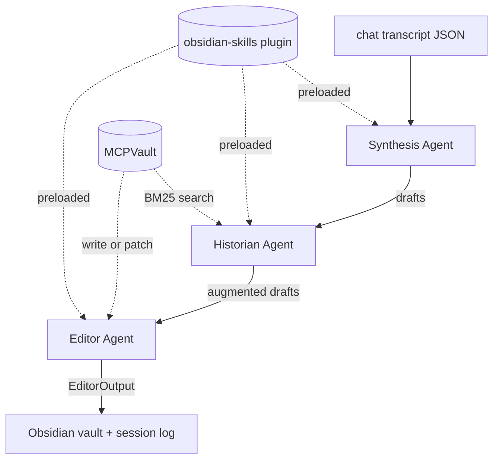

# InsightMesh Core

> A cognitive knowledge engine that compounds understanding over time through multi-agent investigative inquiry, persisted as an evolving Obsidian wiki.

InsightMesh turns your AI chat history into a **growing wiki you actually own**. Local-first, cross-linked, transparent about what it knows.

!!! tip "Latest: Spec 005 — per-page provenance"
    Every wiki page now carries a `provenance:` frontmatter block (latest checkpoint, contributing conversations, action, confidence, total edits, cumulative exchange count) backed by a permanent per-checkpoint JSON record at `<vault>/InsightMesh/.history/checkpoints/<conv-id>/cp-<NNN>.json` plus a shadow git repository for `git log -p` style diff history of every page's evolution across edits. All three transcript shapes (Claude.ai, ChatGPT, Spec 001 flat-array) validated on real data. See the [CLI reference](reference/cli.md#per-checkpoint-provenance-record-spec-005) for the on-disk layout and `specs/005-page-provenance/quickstart.md` in the repo for `jq` + `git log` recipes. A dedicated in-Obsidian viewer plugin ([insightmesh-obsidian](https://github.com/aucontraire/insightmesh-obsidian)) is now available in the [Obsidian community plugin browser](https://community.obsidian.md/plugins/insightmesh-viewer): in Obsidian, open Settings → Community plugins → Browse, search for "InsightMesh Viewer", and Install. Renders the active page's provenance in a side pane with click-through to its source conversation, checkpoint history, and snapshot-to-snapshot diffs. Compatibility: viewer 0.x.x supports core `schema_version=1`. Pre-release builds available via [BRAT](https://github.com/TfTHacker/obsidian42-brat) (`Add Beta Plugin → aucontraire/insightmesh-obsidian`). File issues at [aucontraire/insightmesh-obsidian/issues](https://github.com/aucontraire/insightmesh-obsidian/issues). Prior milestones still apply: Spec 004 (long-chat checkpointing with `--resume` / `--max-exchanges`), Spec 003 (attachment + pasted-text synthesis), Spec 002 (`insightmesh list` + multi-conversation export selection via [`echomine`](https://pypi.org/project/echomine/)).

---

## What it does

You spend hours having intellectually rich conversations with Claude or ChatGPT — and then lose all of that context the moment the session ends. InsightMesh fixes that by reading your transcripts and synthesizing them into organized, cross-linked Obsidian wiki pages.

- **Sub-agent pipeline**: Synthesis → Historian → Editor, each with a single responsibility, all coordinated via the [Claude Agent SDK](https://code.claude.com/docs/en/agent-sdk/overview).
- **Cross-linking that compounds**: the Historian searches your vault (via [MCPVault](https://github.com/bitbonsai/mcpvault)) and weaves `[[wiki links]]` between new and existing pages.
- **Honest reasoning trail**: every page write decision is logged with full rationale — what signals matched, what got skipped, why.
- **Local-first**: data stays on your machine in your Obsidian vault. No cloud, no accounts.

## How it differs from NotebookLM, Perplexity, etc.

- **Knowledge compounds**: not a one-shot research tool — inquiry #50 is richer than inquiry #1 because prior pages get pulled into the synthesis.
- **You own the data**: markdown files in your Obsidian vault, version-controlled, portable.
- **Intellectual transparency**: the multi-agent process is visible in the output. Every decision has a rationale.

## Where to go next

-   :material-rocket-launch: **[Getting Started](getting-started.md)**

    ---

    Full beginner walkthrough: prerequisites, install, Obsidian vault setup, Claude Code plugin install, smoke test, your first real chat.

-   :material-alert-circle: **[Known Limitations](known-limitations.md)**

    ---

    Honest list of what doesn't work yet, what's slow, and what's planned next.

## Architecture (Phase A)

Three sub-agents defined as markdown files in `.claude/agents/`, orchestrated through `claude-agent-sdk`. The Editor uses the [kepano/obsidian-skills](https://github.com/kepano/obsidian-skills) `obsidian-markdown` skill for proper wikilink and frontmatter syntax.

Phase B will eventually migrate orchestration to LangGraph for deterministic execution — but that is triggered by orchestration needs, not the next step. The trigger is the first feature that needs reliable parallel fan-out/fan-in (the multi-perspective Critic + Researcher agents), or the point at which the [SC-001 timing limitation](known-limitations.md#sc-001-timing-2x-over-budget) and orchestrator overhead become a real constraint. Until then the roadmap stays on the sub-agent pipeline: adding agents and richer content handling (attachments, images) as sub-agents while the prompts and JSON contracts stabilize.

## Status

| Feature | Status |
|---------|--------|
| Chat-to-wiki batch synthesis | :material-check: Spec 001 — working |
| Multi-page cross-linking | :material-check: |
| Session logging + decision rationale | :material-check: |
| Same-topic update detection | :material-check: |
| Multi-conversation export selection (pick a chat from a Claude.ai/ChatGPT export) | :material-check: Spec 002 — working |
| Pre-flight validation (vault + agent presence checks) | :material-check: Spec 002 — working |
| Attachment and pasted-text synthesis (Claude exports) | :material-check: Spec 003 — working |
| Long-chat checkpointing + auto-resume + per-invocation cap | :material-check: Spec 004 — working |
| Per-page provenance (checkpoint JSON + frontmatter + shadow-git diff history) | :material-check: Spec 005 — working |
| Live inquiry (ask questions, refine, synthesize) | :material-clock-outline: planned |
| Bias/assumption checking (Critic agent) | :material-clock-outline: planned |
| Web research (Researcher agent) | :material-clock-outline: planned |
