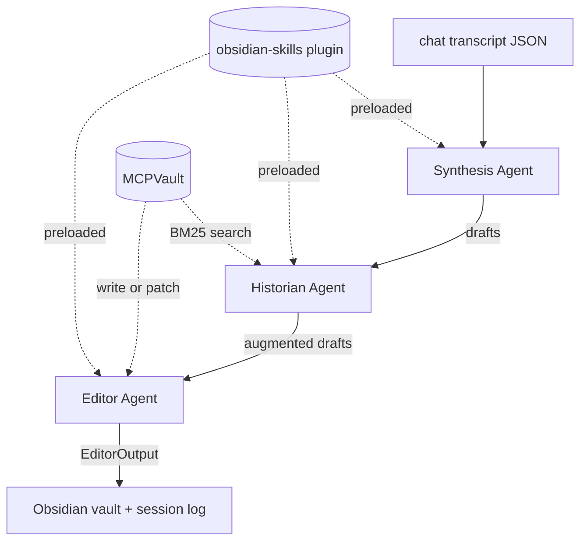

# InsightMesh Core

> A cognitive knowledge engine that compounds understanding over time through multi-agent investigative inquiry, persisted as an evolving Obsidian wiki.

InsightMesh turns your AI chat history into a **growing wiki you actually own**. Local-first, cross-linked, transparent about what it knows.

!!! tip "Spec 002: full Claude.ai / ChatGPT export support"
    `insightmesh list <export.json>` browses conversations in a Claude.ai or ChatGPT data export; `insightmesh batch <export.json> --conversation <id-or-index> --vault <path>` synthesizes the one you pick. The Spec 001 flat `{role, content}` transcript path is preserved unchanged (FR-014 backward compat). Powered by the [`echomine`](https://pypi.org/project/echomine/) library.

---

## What it does

You spend hours having intellectually rich conversations with Claude or ChatGPT — and then lose all of that context the moment the session ends. InsightMesh fixes that by reading your transcripts and synthesizing them into organized, cross-linked Obsidian wiki pages.

- **Sub-agent pipeline**: Synthesis → Historian → Editor, each with a single responsibility, all coordinated via the [Claude Agent SDK](https://code.claude.com/docs/en/agent-sdk/overview).
- **Cross-linking that compounds**: the Historian searches your vault (via [MCPVault](https://github.com/bitbonsai/mcpvault)) and weaves `[[wiki links]]` between new and existing pages.
- **Honest reasoning trail**: every page write decision is logged with full rationale — what signals matched, what got skipped, why.
- **Local-first**: data stays on your machine in your Obsidian vault. No cloud, no accounts.

## How it differs from NotebookLM, Perplexity, etc.

- **Knowledge compounds**: not a one-shot research tool — inquiry #50 is richer than inquiry #1 because prior pages get pulled into the synthesis.
- **You own the data**: markdown files in your Obsidian vault, version-controlled, portable.
- **Intellectual transparency**: the multi-agent process is visible in the output. Every decision has a rationale.

## Where to go next

-   :material-rocket-launch: **[Getting Started](getting-started.md)**

    ---

    Full beginner walkthrough: prerequisites, install, Obsidian vault setup, Claude Code plugin install, smoke test, your first real chat.

-   :material-alert-circle: **[Known Limitations](known-limitations.md)**

    ---

    Honest list of what doesn't work yet, what's slow, and what's planned for Spec 002+.

## Architecture (Phase A)

Three sub-agents defined as markdown files in `.claude/agents/`, orchestrated through `claude-agent-sdk`. The Editor uses the [kepano/obsidian-skills](https://github.com/kepano/obsidian-skills) `obsidian-markdown` skill for proper wikilink and frontmatter syntax.

Phase B (planned in Spec 002+) will migrate orchestration to LangGraph for deterministic execution and to address the [SC-001 timing limitation](known-limitations.md#sc-001-timing-2x-over-budget).

## Status

| Feature | Status |
|---------|--------|
| Chat-to-wiki batch synthesis | :material-check: Spec 001 — working |
| Multi-page cross-linking | :material-check: |
| Session logging + decision rationale | :material-check: |
| Same-topic update detection | :material-check: |
| Multi-conversation export selection (pick a chat from a Claude.ai/ChatGPT export) | :material-check: Spec 002 — working |
| Live inquiry (ask questions, refine, synthesize) | :material-clock-outline: Spec 002 — planned |
| Bias/assumption checking (Critic agent) | :material-clock-outline: Spec 003 — planned |
| Web research (Researcher agent) | :material-clock-outline: Spec 003 — planned |
